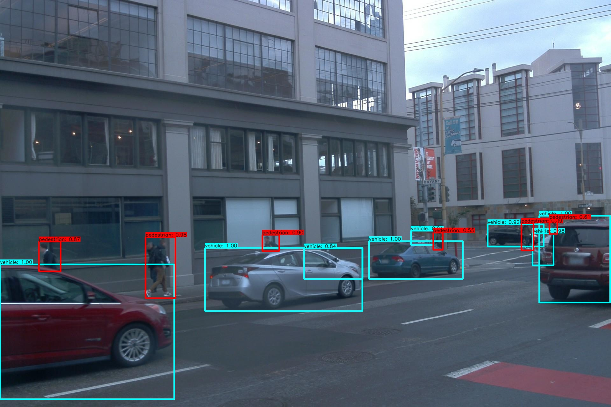
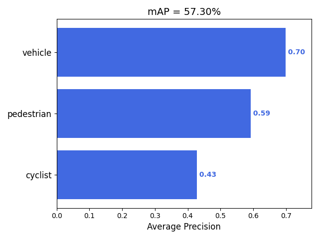
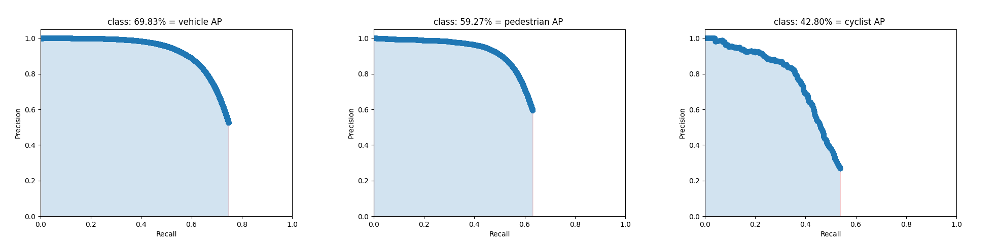

# Tensorflow 1.x YOLOv4 Implementation

YOLOv4 Object Detection on WAYMO Datasets.

## Dependencies
- python 3.6+
- opencv
- tqdm
- easydict
- tensorflow-gpu 1.14

## Result
1. Visual Detection Result


2. PASCAL VOC mAP



3. Precision-Recall Curve



## Configure Your Dataset 
1. path: data/classes/waymo.names
```bashrc
vehicle
pedestrian
sign
cyclist
```
2. path: data/dataset/waymo_train.txt (waymo_val.txt)
```bashrc
datapath/train/tr25-24-10-2-FRONT_LEFT.jpg 738,265,772,358,1 628,285,662,333,1 
datapath/train/tr10-19-10-1-FRONT.jpg 232,280,238,287,0 323,275,330,280,0 389,277,398,283,0 
datapath/train/tr01-20-2-2-FRONT_LEFT.jpg 744,297,772,308,0 770,292,800,308,0 
```

## Train & Test
1. Train
```bashrc
$ python train.py
```

2. Test
```bashrc
$ python test.py
```
3. Output format: {image_name}.txt [ class_name confidence x1 y1 x2 y2 ]
```bashrc
vehicle 0.980528 194 356 466 513
vehicle 0.897605 752 372 975 467
pedestrian 0.605162 844 178 867 225
cyclist 0.602555 816 176 841 224
```

## References
The implementation was adapted from the below references:
- https://github.com/YunYang1994/tensorflow-yolov3
- https://github.com/hunglc007/tensorflow-yolov4-tflite

Korea, May 2021

Le-Anh Tran
